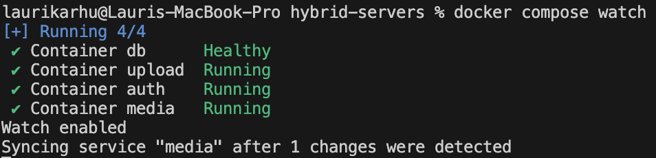

## Docker harjoitus

Olin aiemmalla kurssilla tehnyt hybrid palvelimista monorepo tyylisen oman repositorion, jota muokkasin ja joka oli helppo ajaa. Tein siihen docker harjoituksen, jossa on yksi Dockerimage kaikille palvelimille ja docker-compose jolla ajetaan kolme palvelinta ja tietokanta.

Docker kontit sisältävät rakennuksen jälkeen node ympäristön, node_modules kansion ja rakennetun koodin dist kansiossa.

Toteutin watch ominaisuuden hieman eri tavalla kuin esimerkissä

Totesin kokeilemalla, että expressissä vakiona palvelin pyörii osoitteessa 0.0.0.0 joten en joutunut muokkaamaan koodia ollenkaan, vaikka tehtävänannossa niin kehotettiin. Palvelimet keskustelevat dockerin sisäisessä verkossa osoitteilla kuten http://media:3000 ja ulospäin ne näkyvät docker composessa määritellyillä porteilla kuten localhost:3000.

Tein myös volyymin jossa on tietokanta ja tietokannan alustus skripti, joka ajetaan vain ensimmäisellä kerralla kun kontti luodaan. Käytin myös healthcheck ominaisuutta, joka tarkistaa että tietokanta on käynnissä ennen kuin muut palvelimet yrittävät yhdistää siihen.

Käytin .env.docker tiedostoja (jotka on gitissä helppouden vuoksi) jotta docker compose tiedostossa ei ole ympäristömuuttujia kovakoodattuna.

Julkaisin sovelluksen kotipalvelimelleni, joka toimii cloudflaren kanssa. Testasin myös, että docker toimii täysin automaattisesti, eli kun sammutan ja käynnistän palvelimen uudestaan, niin palvelimet pyörivät automaattisesti uudestaan.
